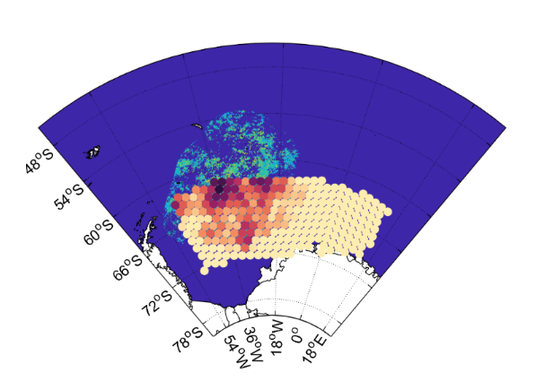
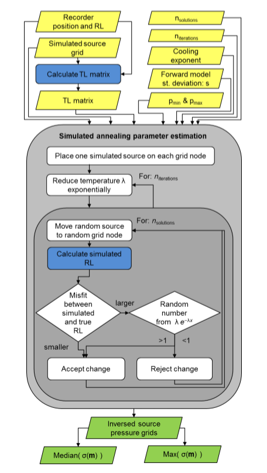

# ambient-sound-inversion
Parallel computing paramter estimation code used to estimate marine mammal distribution from ambient sound spectra 

Run on the Hexagon UIB unix cluster with with one paraanneal.py running on each 32 cpu node

Example source node grid. For each nod the marine mammal source level is estimated

The algorithm:

Intial development started in my master thesis: https://www.researchgate.net/publication/312576168_Estimating_fin_whale_distribution_from_ambient_noise_spectra_using_Bayesian_inversion
