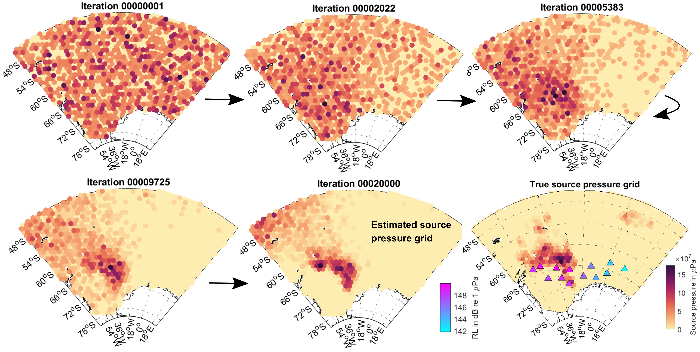
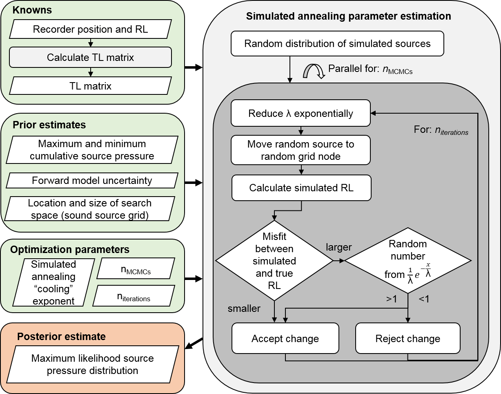

# Supplementary code for the paper "Estimating the spatial distribution of vocalizing animals from ambient sound spectra using widely spaced recorder arrays and inverse modelling"

by Sebastian Menze, Daniel Zitterbart, Martin Biuw and Olaf Boebel

paper submitted to JASA in 2019

contact: sebastian.menze@hi.no

Parallel computing paramter estimation code used to estimate marine mammal distribution from ambient sound spectra 
development by Sebastian Menze

created and tested with Matlab 2016a and Python 2.7

Run on the Hexagon UIB unix cluster and fram.sigma2.no clusterwith with one paraanneal.py running per 32 cpu node

# These liberaries needs to be downloaded separately:

Grid sphere package to generate geodesic grids:

https://se.mathworks.com/matlabcentral/fileexchange/28842-grid-sphere

cmocean colormaps:

https://se.mathworks.com/matlabcentral/fileexchange/57773-cmocean-perceptually-uniform-colormaps

m_map mapping package:

https://www.eoas.ubc.ca/~rich/map.html

freezeColors code to use multiple colormaps on the same figure axis:

https://se.mathworks.com/matlabcentral/fileexchange/7943-freezecolors-unfreezecolors

function to calculate seawater sound absoption such as this one:

https://se.mathworks.com/matlabcentral/fileexchange/28653-acoustic-absorption-in-seawater

function to generate random matrices:

https://se.mathworks.com/matlabcentral/fileexchange/59305-randnd

# Contents of this folder:

matlab script to generate and analyse inversion test scenarios

codeforpaper.m

parallel parameter optimization pyhton code (simulated annealing):

paraanneal.py

shell script to compute MCMCs on unix cluster:

paraanneal.sh

matlab function to calculate geometrical transmission loss:

tl_matrix_geometrical_spreading.m

matlab function to calculate RL:

received_pressure.m

matlab code for parameter optimization (in older format, not used for paper):

sa_parameter_estimation.m

Schematic view of source pressure grid change during simulated annealing over 20000 iterations. Colored dots represent the source pressure at each node in μPa (yellow to red hues, normalized for each panel). Lower right plot shows the true source pressure grid and recorder locations where the received levels in dB re 1 μPa are marked by blue and pink triangles. 

Flowchart of the inversion method and simulated annealing parameter estimation algorithm. Input variables are marked green, the output red. Grey round boxes represent the computational parts of the method. λ is the simulated annealing “temperature” parameter that steers how much decreases in likelihood are tolerated at each iteration. 

